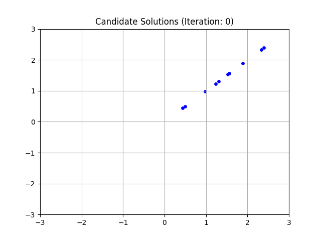
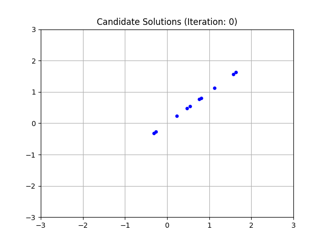

# BigBang-BigCrunch
Big Bang–Big Crunch algorithm implemented in JAX.

## Table of Contents
- [Bang–Big Crunch (BB–BC) Algorithm](#algorithm)
- [Solutions](#solutions)
- [License](#license)

## Algorithm
This repository implements an optimization method called the Big Bang–Big Crunch (BB–BC) method, which draws inspiration from the theories of the universe's evolution ([Erol, O. K., & Eksin, I., 2006)](https://www.sciencedirect.com/science/article/abs/pii/S0965997805000827). The BB–BC method is a population-based search that incorporates random variation and selection, similar to traditional evolutionary algorithms. The key idea is to model the optimization process based on the Big Bang and Big Crunch phases, where randomness and order emerge, respectively. By generating random points in the initial phase (Big Bang) and then converging them into a single representative point in the final phase (Big Crunch).

The algorithm is summarized below:
1. Generate $N$ initial candidate solutions randomly.

    $$X = \{x_1, x_2, \dots, x_N \}$$
    $$X \sim N(0, 1)$$

2. Calculate the fitness for each candidate solution:
    $$f_i = fitness(x_i)$$

    (example fitness functions are give in [Solutions](#solutions))
     
3. Calculate the center of mass with eqaution below (referred as Eq. 2 in the original paper):
    $$x_c = \frac{\sum^N_{i=1}{\frac{1}{f_i}}x_i}{\sum^N_{i=1}{\frac{1}{f_i}}}$$
4. Update the candiate solutions with the equation below: 

    $$x_{new} = x_c + \frac{lr}{k}$$

    where $l$ is the upper limit, $r$ is a normally distributed random number and $k$ is the iteration step

5. Repeat steps 2, 3 and 4 until max iteration i completed. 

## Solutions

(NOTE: Results are shown until iteration 100)

(NOTE 2: Solutions are 1D arrays but x-axis is repeated to y axis to project into 2D for observation.)

### Polynomial Solution
Fitness equation is $fitness(x) = -(x-2)^2+2$:
- Highest fitness value is $0$ and it is at point $x=2$
- We can see that BB–BC method finds the solution at $x=2$

### Sigmoid Solution
Fitness equation is $fitness(x) = \frac{1}{1+e^{-x}}$:
- Sigmoid function squashes input values into a range between 0.0 and 1.0. So, highest possible value fitness is 1.0.
- Highest fitness value is at highest input.
- Therefore, we can see that BB–BC method keeps increasing the solution value.
- Increments to the solution slows down in each iteration. 
    - This is due to the fact that sigmoid gets closer to the value of 1.0.

## License
This project is licensed under the MIT License - please see the [LICENSE](LICENSE) file for details.